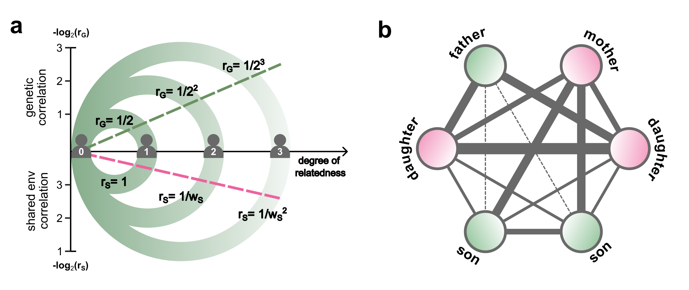

# BIGFAM

<p align="center">

<!-- width="800" height="180"/></p> -->
<!-- {: width="100%" height="100%"} -->

## Introduction

BIGFAM is a model that estimates heritability using relatives phenotype without genotype.
This model does not require genotype information and uses only phenotype and familial relationship data as input.

## Software requirements

### OS Requirements

The package has been tested on the following systems:

- macOS: Ventura v.13.0.1
- Linux: CentOS v.7

### Python Dependencies

The package has been developed with dependencies in files `environment.yaml`


## Installation Guide:

The installation process takes a few seconds, including downloading test data.

```
git clone https://github.com/jerrylee9310/BIGFAM
```

## Usage

BIGFAM requires two types of input:

1. Phenotype data, which consists of three columns (ID, ID, phenotype). Check the example format in `test/test.phen`.
2. Relationship information data, which consists of two columns (ID1, ID2) representing pairs of individuals with specific familial relationships. Check the example format in `test/test.info`.

Details of each process can be found in `main.ipynb`.

## Miscellaneous


## License
The BIGFAM Software is freely available for non-commercial academic research use. For other usage, one must contact Buhm Han (BH) at buhm.han@snu.ac.kr. WE (Jaeeun Lee and BH) MAKE NO REPRESENTATIONS OR WARRANTIES WHATSOEVER, EITHER EXPRESS OR IMPLIED, WITH RESPECT TO THE CODE PROVIDED HERE UNDER. IMPLIED WARRANTIES OF MERCHANTABILITY OR FITNESS FOR A PARTICULAR PURPOSE WITH RESPECT TO CODE ARE EXPRESSLY DISCLAIMED. THE CODE IS FURNISHED "AS IS" AND "WITH ALL FAULTS" AND DOWNLOADING OR USING THE CODE IS UNDERTAKEN AT YOUR OWN RISK. TO THE FULLEST EXTENT ALLOWED BY APPLICABLE LAW, IN NO EVENT SHALL WE BE LIABLE, WHETHER IN CONTRACT, TORT, WARRANTY, OR UNDER ANY STATUTE OR ON ANY OTHER BASIS FOR SPECIAL, INCIDENTAL, INDIRECT, PUNITIVE, MULTIPLE OR CONSEQUENTIAL DAMAGES SUSTAINED BY YOU OR ANY OTHER PERSON OR ENTITY ON ACCOUNT OF USE OR POSSESSION OF THE CODE, WHETHER OR NOT FORESEEABLE AND WHETHER OR NOT WE HAVE BEEN ADVISED OF THE POSSIBILITY OF SUCH DAMAGES, INCLUDING WITHOUT LIMITATION DAMAGES ARISING FROM OR RELATED TO LOSS OF USE, LOSS OF DATA, DOWNTIME, OR FOR LOSS OF REVENUE, PROFITS, GOODWILL, BUSINESS OR OTHER FINANCIAL LOSS.

## Reference
BIGFAM - variance components analysis from relatives without genotype, _under review_.